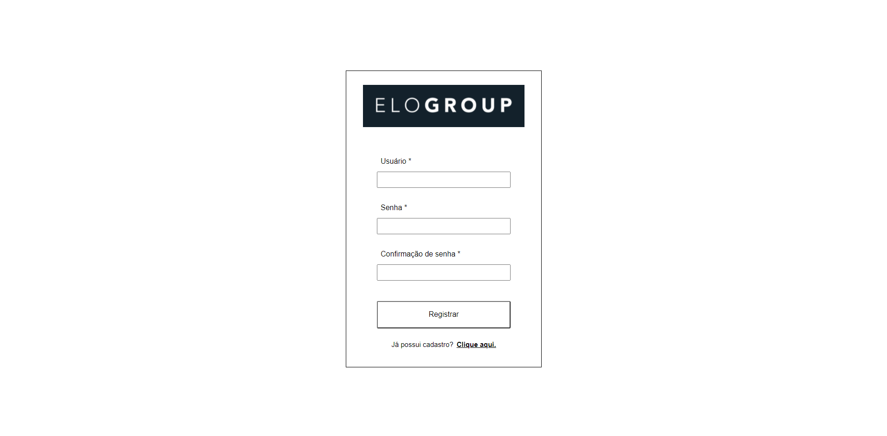
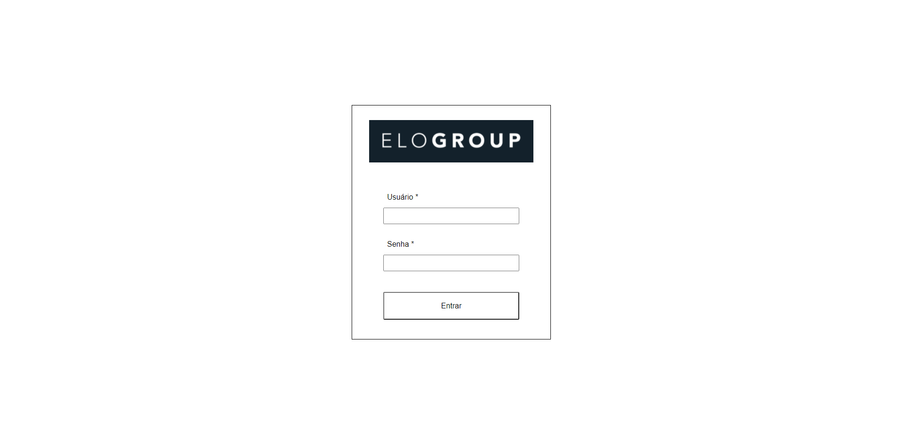
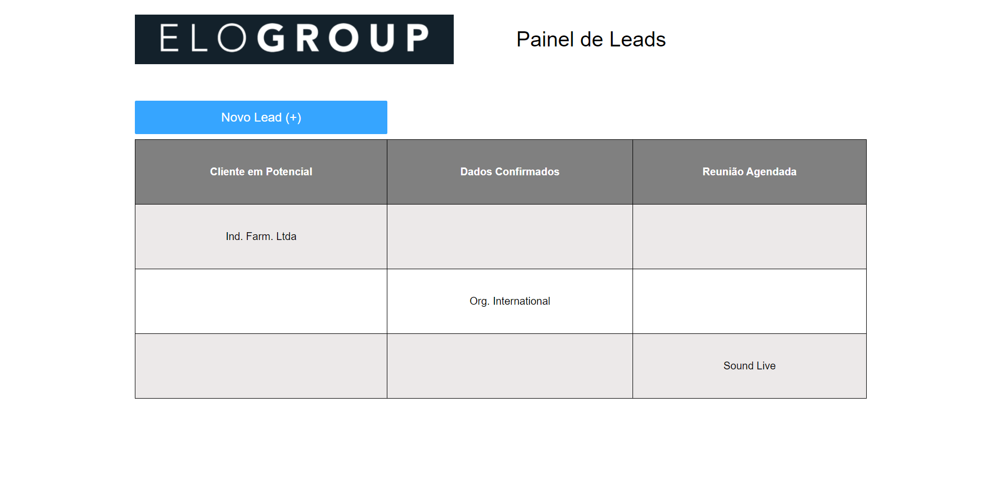
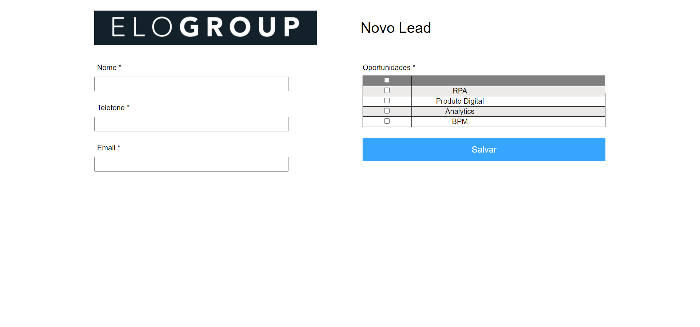

# Desafio de Frontend com React e LocalStorage

 

  
  

 

Esta é uma aplicação frontend que tem como objetivo fazer a manutenção de Leads, e utiliza o localstorage do navegador como mecanismo de persistência para armazenar a lista de
Leads, bem como os novos usuários criados.

 

## :hammer_and_wrench: Funcionalidades:

### Tela de cadastro de usuário:
Todos os campos são obrigatórios; a senha deve possuir ao menos 8 caracteres, contendo pelo menos, um caracter especial, um caracter numérico, um caracter maiúsculo, um caracter minúsculo; a senha e confirmação de senha devem ser iguais.

### Tela de login:
Estando já cadastrado no sistema (ou seja, se os dados do usuário já estiverem salvos no localstorage), basta informar o nome de usuário e a senha para efetuar o login na aplicação.

### Painel de Leads:
Possui uma tabela para exibição dos Leads por Status: Cliente em Potencial, Dados Confirmados, Reunião Agendada; cada Lead poderá ser “arrastado” (tendo assim seu status interno alterado) na
seguinte sequencia: Cliente em Potencial >> Dados Confirmados, Dados Confirmados >> Reunião
Agendada. Para que um Lead seja incluído na tabela, deverá ser utilizada a opção "Novo Lead(+)" (um botão), e uma nova tela com o formulário para cadastro será disponibilizada.

### Cadastro de um novo Lead:
Todos os campos são obrigatórios; As oportunidades podem ser marcadas/desmarcadas individualmente (através de CheckBoxes); Ao clicar no CheckBox no cabeçalho da coluna esquerda na grade de oportunidades, este marca ou desmarca todos; ao clicar no botão de Salvar, é exibida uma mensagem de confirmação de que o Lead foi incluído com sucesso; o Lead é incluído com o Status inicial de “Cliente em Potencial".

 

## :man_technologist: Imagens da Aplicação

### Tela de cadastro de usuário

 

### Tela de login

 

### Painel de Leads

 

### Cadastro de um novo Lead

 

 

## :nerd_face: Como rodar esse projeto no seu computador:

Após efetuar o download ou o clone do projeto, e estando dentro da pasta raiz, realizar os seguintes comandos no terminal:

### `yarn install`

Esse comando serve para instalar todas as dependências necessárias para o projeto funcionar.

### `yarn start`

 Esse comando irá executar a aplicação em modo de desenvolvimento. 

Abra http://localhost:3000 para ver a aplicação funcionando no browser.

  

Made with 🧡 and :coffee: | Find me on <a href="https://www.linkedin.com/in/vivianebresolin/"> LinkedIn</a>

